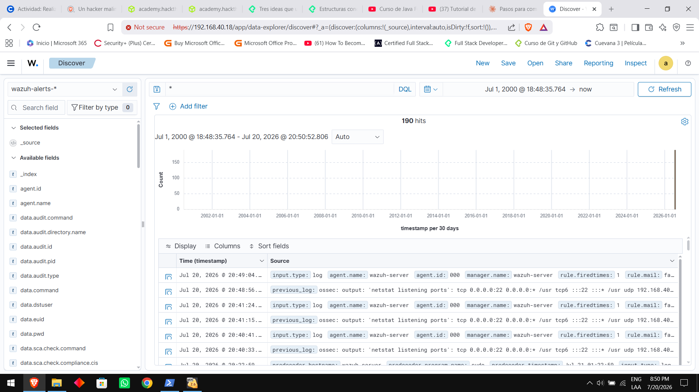

# Cloud SOC Lab: Wazuh SIEM & Detection Engineering

Laboratorio defensivo (Blue Team) desplegado en un servidor VPS en la nube (Ubuntu 22.04 LTS) enfocado en telemetria en tiempo real, ingenieria de deteccion bajo la matriz **MITRE ATT&CK** y gestion de incidentes.

---

## 1. Arquitectura del Sistema
* **SIEM / XDR:** Wazuh v4.8.0 (Despliegue Docker optimizado con Heap de Java a 2 GB).
* **Telemetria:** Agente Wazuh + File Integrity Monitoring (FIM) + Syslog.
* **Aislamiento:** Panel web en puerto \8443\ y entorno web de pruebas aislado.

---

## 2. Escenarios de Deteccion Implementados

### Caso 1: Deteccion de Web Shells via FIM (MITRE ATT&CK T1505.003)
* **Mecanismo:** Modulo FIM en tiempo real sobre \/opt/mini-soc-lab/lab_web_test/\.
* **Resultado:** Alerta instantanea (Regla 554, Nivel 5) con extraccion automatica de hash SHA-256.

---

### Caso 2: Deteccion de Evasion con Base64 (MITRE ATT&CK T1027 / T1059)
* **Mecanismo:** Regla XML personalizada (\Rule 100002\, Nivel 10) para interceptar comandos decodificados en memoria.
* **Resultado:** Deteccion de la ejecucion indexada en el panel de Threat Hunting.

---

## 3. Estructura del Repositorio
* [\configs/\](configs/): Configuracion de telemetria y agente Wazuh.
* [\custom-rules/\](custom-rules/): Reglas personalizadas de deteccion en formato XML.
* [\playbooks/\](playbooks/): Procedimientos Estandar de Operacion (SOP) para analisis y contencion.
* [\
eports/\](reports/): Informes formales de incidentes formato SOC Tier 1.
* [\docs/\](docs/): Evidencias visuales y capturas del SIEM.
